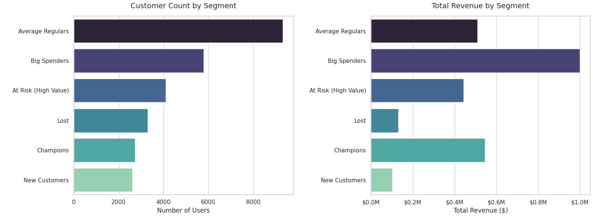
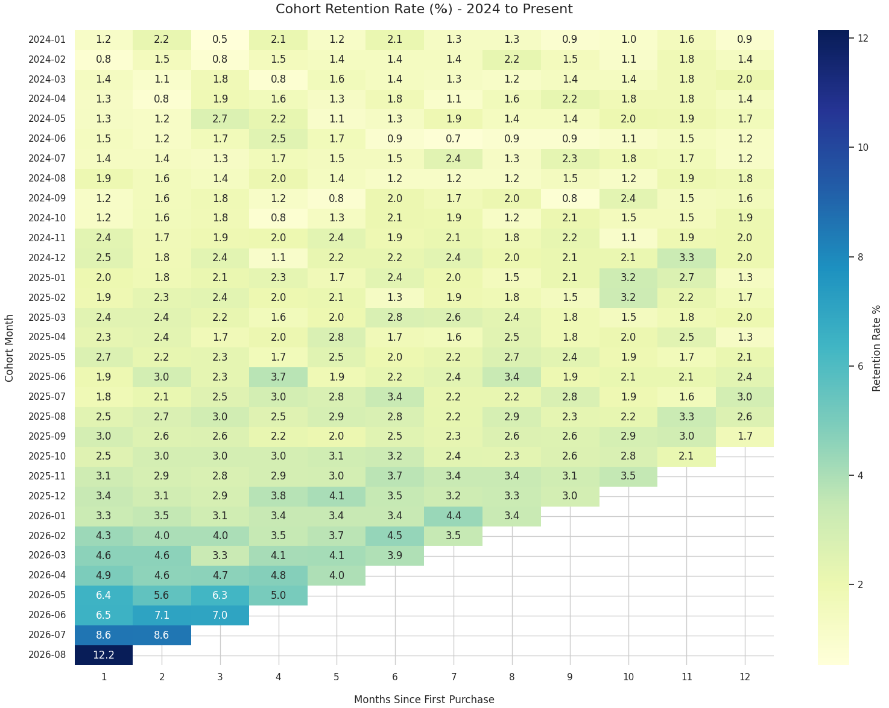

# E-Commerce Customer Retention & Lifecycle Analytics

> **[📊 View Live Interactive Executive Dashboard on Tableau Public](https://public.tableau.com/app/profile/ivan.nathanael/viz/Ecommerce_Lifecycle_and_Revenue_Retention_Executive_Summary/Dashboard1?publish=yes)**

## Executive Summary
This project analyzes customer lifecycle behavior using the `TheLook eCommerce` dataset natively hosted in Google BigQuery. The objective is to move beyond basic aggregate metrics to actionable business intelligence: identifying high-value customer segments, calculating month-over-month cohort retention, and smoothing daily revenue volatility using rolling averages.

**Key Technical Skills Demonstrated:**
*   **SQL Dialect:** Google BigQuery (Standard SQL)
*   **Business Intelligence:** Tableau (Interactive Executive Dashboard, Data Densification, Dual-Axis Time Series)
*   **Core Concepts:** Multi-level Common Table Expressions (CTEs), Window Functions (`NTILE`, `AVG OVER`, `MIN OVER`), Dynamic Date Spines, Relational Joins, and Cohort Date Truncation.

### Project Architecture & Data Flow

```mermaid
graph TD
    subgraph Cloud Data Warehouse
        BQ[(Google BigQuery Public Datasets)]
    end

    subgraph SQL Processing Engine
        SQL1[01_rfm_segmentation.sql<br/>Window Functions & CASE]
        SQL2[02_cohort_retention.sql<br/>CTEs & Date Truncation]
        SQL3[03_rolling_revenue.sql<br/>Dynamic Calendar Spine]
    end

    subgraph Business Intelligence Layer
        EXTRACT[(Tableau Extract Data<br/>.hyper format)]
        TAB[Tableau Public<br/>Interactive Dashboard]
    end

    subgraph Deliverables
        VIZ1[RFM Segment Treemap]
        VIZ2[Densified Retention Heatmap]
        VIZ3[Dual-Axis Time Series]
        PORTFOLIO[Live Executive Dashboard]
    end

    BQ -->|Query Execution| SQL1
    BQ -->|Query Execution| SQL2
    BQ -->|Query Execution| SQL3

    SQL1 -->|Export Data| EXTRACT
    SQL2 -->|Export Data| EXTRACT
    SQL3 -->|Export Data| EXTRACT

    EXTRACT -->|Embed Data| TAB

    TAB -->|Render| VIZ1
    TAB -->|Render| VIZ2
    TAB -->|Render| VIZ3

    VIZ1 --> PORTFOLIO
    VIZ2 --> PORTFOLIO
    VIZ3 --> PORTFOLIO
```


---


## Part 1: RFM Customer Segmentation
**The Business Problem:** Treating all customers equally leads to inefficient marketing spend. The business needs to identify its most valuable segments—not just by frequency, but by absolute monetary contribution—and isolate high-value users who are at risk of churning.

**The Technical Solution:** A query that calculates Recency (days since last order), Frequency (total orders), and Monetary value (total spend). It scores them into quintiles using the `NTILE(5)` window function and uses a 3-dimensional `CASE` statement to assign categorical business labels based on multidimensional behavior (e.g., isolating high-spend, low-frequency users from high-frequency, low-spend users).

### Visualization: Customer Segment Distribution

<p align="center">
  
</p>

<p align="center">
  
</p>

**Business Insights Derived:**
*   **The "Big Spender" Dependency:** While "Average Regulars" make up the largest portion of the user base (over 8,000 users), the "Big Spenders" segment (~5,800 users) generates double the revenue ($1.0M vs $0.5M). The business relies heavily on high-cart-value transactions rather than frequent, smaller purchases.
*   **Actionable Churn Risk:** There are approximately 4,000 "At Risk (High Value)" customers who previously demonstrated strong purchasing behavior but have not returned recently. This segment alone represents nearly $0.45M in historical revenue, making it the primary target for an immediate win-back discount campaign.

### The SQL Query (`01_rfm_segmentation.sql`)
```sql
WITH base_metrics AS (
  SELECT 
    user_id,
    MAX(DATE(created_at)) AS last_purchase_date,
    COUNT(DISTINCT order_id) AS frequency,
    ROUND(SUM(sale_price), 2) AS monetary
  FROM `bigquery-public-data.thelook_ecommerce.order_items`
  WHERE status = 'Complete'
  GROUP BY user_id
),
scoring AS (
  SELECT 
    user_id,
    frequency,
    monetary,
    DATE_DIFF(
      (SELECT MAX(DATE(created_at)) FROM `bigquery-public-data.thelook_ecommerce.order_items`), 
      last_purchase_date, 
      DAY
    ) AS recency_days,
    NTILE(5) OVER (ORDER BY last_purchase_date ASC) AS r_score,
    NTILE(5) OVER (ORDER BY frequency ASC) AS f_score,
    NTILE(5) OVER (ORDER BY monetary ASC) AS m_score
  FROM base_metrics
)
SELECT 
  user_id,
  recency_days,
  frequency,
  monetary,
  CASE 
    WHEN r_score >= 4 AND f_score >= 4 AND m_score >= 4 THEN 'Champions'
    WHEN m_score >= 4 AND f_score <= 3 THEN 'Big Spenders'
    WHEN r_score <= 2 AND (f_score >= 4 OR m_score >= 4) THEN 'At Risk (High Value)'
    WHEN r_score >= 4 AND f_score <= 2 AND m_score <= 3 THEN 'New Customers'
    WHEN r_score <= 2 AND f_score <= 2 AND m_score <= 3 THEN 'Lost'
    ELSE 'Average Regulars'
  END AS customer_segment
FROM scoring
ORDER BY monetary DESC;
```

## Part 2: Cohort Retention Matrix
**The Business Problem:** How sticky is the product? Do users who buy in Month 1 return to buy in Month 2, Month 3, and beyond? If the business relies on one-off purchases, acquisition costs will eventually outpace lifetime value (LTV).

**The Technical Solution:** A multi-CTE script that establishes a "Cohort Month" for every user based on their first purchase, maps all subsequent active months to an integer index (1, 2, 3...), and calculates the percentage of the original cohort retained in each period. *Note: Month 0 (the month of initial purchase) is excluded from the visualization as it is mathematically 100% and skews the color gradient.*

### Visualization: Retention Matrix Heatmap (2024 - Present)



**Business Insights Derived:**
*   **Severe Churn Reality:** The data reveals an immediate, severe drop-off. Month 1 retention rarely breaks 5%. Over 95% of acquired customers make a single purchase and never return. 
*   **Strategic Alignment with RFM:** This validates the findings from the RFM analysis. The business is heavily dependent on high-ticket, one-off purchases ("Big Spenders") rather than cultivating a recurring user base. 
*   **Recommendation:** Marketing budget should be reallocated from top-of-funnel acquisition to post-purchase lifecycle sequences (e.g., day-15 cross-sell emails) to force a second purchase and improve Month 1 stickiness.

### The SQL Query (`02_cohort_retention.sql`)
```sql
WITH user_cohorts AS (
  SELECT 
    user_id,
    DATE_TRUNC(MIN(DATE(created_at)), MONTH) AS cohort_month
  FROM `bigquery-public-data.thelook_ecommerce.orders`
  WHERE status NOT IN ('Cancelled', 'Returned')
  GROUP BY user_id
),
user_activities AS (
  SELECT DISTINCT
    user_id,
    DATE_TRUNC(DATE(created_at), MONTH) AS activity_month
  FROM `bigquery-public-data.thelook_ecommerce.orders`
  WHERE status NOT IN ('Cancelled', 'Returned')
),
cohort_indexes AS (
  SELECT 
    c.user_id,
    c.cohort_month,
    a.activity_month,
    DATE_DIFF(a.activity_month, c.cohort_month, MONTH) AS month_index
  FROM user_cohorts c
  JOIN user_activities a ON c.user_id = a.user_id
),
cohort_sizes AS (
  SELECT 
    cohort_month,
    COUNT(DISTINCT user_id) AS initial_users
  FROM cohort_indexes
  WHERE month_index = 0
  GROUP BY cohort_month
),
retention_counts AS (
  SELECT 
    cohort_month,
    month_index,
    COUNT(DISTINCT user_id) AS retained_users
  FROM cohort_indexes
  GROUP BY cohort_month, month_index
)
SELECT 
  r.cohort_month,
  s.initial_users,
  r.month_index,
  r.retained_users,
  ROUND((r.retained_users / s.initial_users) * 100, 2) AS retention_rate_pct
FROM retention_counts r
JOIN cohort_sizes s ON r.cohort_month = s.cohort_month
ORDER BY r.cohort_month, r.month_index;
```

## Part 3: Smoothing Revenue Volatility (Calendar Spine)
**The Business Problem:** E-commerce sales are highly seasonal by day of the week (e.g., weekend slumps vs. mid-week spikes). Reporting on raw daily revenue creates a noisy, volatile chart that obscures the true growth or decline trend. Furthermore, standard window functions fail if days with zero sales are missing from the database.

**The Technical Solution:** The SQL script dynamically bounds the dataset, generates a continuous array of dates (`GENERATE_DATE_ARRAY`), and uses a `LEFT JOIN` to enforce `$0` sales on inactive days. This guarantees the mathematical integrity of the 7-day rolling window by ensuring `AVG() OVER()` does not skip empty dates.

### Visualization: Daily vs. 7-Day Rolling Revenue (2026 YTD)


**Business Insights Derived:**
*   **Noise Reduction:** The faint blue baseline reveals the daily volatility. The 7-day rolling average successfully smooths this day-of-week seasonality, revealing a steady baseline revenue of roughly $10,000/day throughout the first three quarters of 2026.
*   **Anomaly Detection:** The chart immediately exposes a massive anomaly in late September 2026, where raw daily revenue spiked nearly 8x to ~$90,000. As an analyst, this triggers an immediate required follow-up investigation: was this caused by a highly successful Q3 marketing campaign, an institutional bulk order, or a data duplication error in the pipeline? 
*   **Strategic Metric:** Marketing and operations teams should benchmark against this smoothed 7-day rolling average rather than reacting to isolated daily dips, preventing panic over standard weekend purchasing drops.

### The SQL Query (`03_rolling_revenue.sql`)
```sql
WITH date_bounds AS (
  SELECT 
    MIN(DATE(created_at)) AS min_date,
    MAX(DATE(created_at)) AS max_date
  FROM `bigquery-public-data.thelook_ecommerce.order_items`
),
calendar_spine AS (
  SELECT date
  FROM date_bounds,
  UNNEST(GENERATE_DATE_ARRAY(min_date, max_date, INTERVAL 1 DAY)) AS date
),
daily_sales AS (
  SELECT 
    DATE(created_at) AS sale_date,
    ROUND(SUM(sale_price), 2) AS total_revenue
  FROM `bigquery-public-data.thelook_ecommerce.order_items`
  WHERE status NOT IN ('Cancelled', 'Returned')
  GROUP BY sale_date
),
spine_joined AS (
  SELECT 
    c.date AS calendar_date,
    COALESCE(d.total_revenue, 0) AS daily_revenue
  FROM calendar_spine c
  LEFT JOIN daily_sales d ON c.date = d.sale_date
)
SELECT 
  calendar_date,
  daily_revenue,
  ROUND(
    AVG(daily_revenue) OVER(
      ORDER BY calendar_date 
      ROWS BETWEEN 6 PRECEDING AND CURRENT ROW
    ), 2
  ) AS rolling_7_day_avg
FROM spine_joined
ORDER BY calendar_date DESC;
